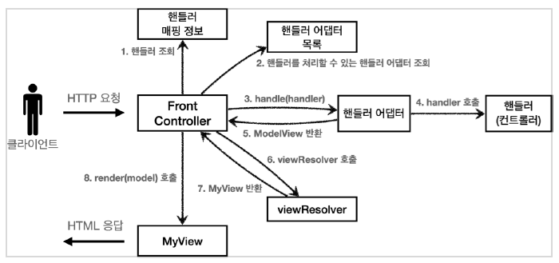

# Spring MVC 원리 1 

---
본 프로젝트는  Spring MVC 원리를 이해하기 위해서 @WebServlet를 사용하여 서블릿을 등록하는 과정부터
현재 RequestMapping를 통해 FrontController인 DispatcherServlet 에 HandlerMapping 로 등록하는 과정을 전진적으로 개발 하여 구현하였습니다.

### Servlet 이란
클라이언트 요청을 처리하고 그 결과를 반환 하도록 Servlet 클래스의 구현 규칙을 지킨 자바 웹 프로그래밍

#### HttpServlet
클라이언트가 HTTP 요청 시 정해진 패턴을 가지고 서버에 HTTP 요청을 보내게 되는데 이 과정에서
header 정보, 쿠키정보, body 정보 들을 정해진 객체에 담겨 읽어 올 수 있도록 도와주는 클래스

※ HttpServlet 이 있기에 Http 요청으로 부터 오는 요청 정보를 HttpServlet 클래스로 쉽게 접근 할 수 있다.

## MVC 아키텍쳐의 발달 과정
1. 브라우저로 부터의 요청을 JSP 내에서 직접 처리
    - (단점)JSP에서 비즈니스 로직을 처리하기 때문에 jsp 파일의 크기가 매우 커졌으며 유지보수가 매우 어렵다.
   
2. 모델, 뷰, 컨트롤러로 나누어 각각 역할을 명확하게 분리
   - 각 요청에 맞는 서블릿클래스를 생성하고 각 서블릿에 View 파일의 path를 등록해준다.
   - (단점)모든 요청에 따른 서블릿을 생성해줘야 하며 각 요청의 맞는 모델과 뷰정보를 직접 넣어줘야하는 단점이 있다.
3. 모든 요청을 한곳에서 관리 할 수 있도록 FrontController를 생성
   - 모든 요청과 관련된 정보를 한곳에서 관리 할 수 있다.
   - (단점) 모든 요청을 한곳에서 관리하지만 뷰와 관련된 정보와, 모델 관련된 정보를 수정하기 위해서는 각각의 Servlet에서 수정해주어야한다.
4. 뷰 리졸버를 생성하여 뷰정보를 관리
    - 매번 서블릿에서 path를 지정해주던 것을 prefix 와 suffix 를 설정하여 파일이름만을 통해서 뷰 화면을 찾을 수 있게됨
5. Adapter 패턴을 사용하여 여러 타입을 사용하여 요청 주소와 뷰화면을 찾을 수 있도록 설정 
    - 각각의 HandlerMapping 구현체들과 viewResolver , 등 여러 mvc 요소들에 Adapter를 적용하여 각각의 타입에 맞는 adapter를 사용하여 여러 가지 요소를 한번에 사용하도록 구현
    - 예를 들어 요청 주소를 설정하는 방법으로 RequestMapping을 사용하거나 Bean name을 통해 설정 할 수 있는데 각각 알맞은 Adapter에서 처리하여 요청주소를 찾는다 
6. RequestMapping을 사용하여 요청 주소를 등록하고 viewResolver를 통해 파일이름을 반화하여 페이지 처리
   - 각각 별로 Servlet을 구현해주던 방식에서 FrontController에 RequestMapping을 통해 웹페이지 요청 정보를 등록해주며 뷰리졸버를 통해 파일 명으로 페이지에 접근 

## 결론 현재의 Spring MVC

HTTP 요청은 FrontController(DispatcherServlet)에서 등록된 HandlerAdapter, HandlerMappings, ViewResolver, 등에 따라
각 들어오는 요청 타입에 맞는 아답터를 찾아 처리 되며 예외 또한 등록된 예외 처리 핸들러에 의해 처리된다.

주요 인터페이스   
HandlerAdapter  :  요청 주소 관련 처리를 담당    
ex) RequestMappingHandlerAdapter(RequestMapping 요청 담당)

HandlerMapping : 요청 주소 정보를 담당   
ex) BeanNameUrlHandlerMapping(빈이름을 통한 요청 주소 설정),  RequestMappingHandlerMapping(RequestMapping 어노테이션을 통한 요청 주소 설정)

ViewResolver : view 파일 경로 관련 담당
ex) InternalResourceViewResolver, ThymeleafViewReviewResolver

HandlerExceptionResolver : 예외 처리 관련 담당
ex) ExceptionHandlerExceptionResolver(@ExceptionHandler 처리), ResponseStatusExceptionResolver(@ResponseStatus 에러 처리)

HandlerMethodArgumentResolver  :  RequestMapping 요청시 들어오는 매개변수 타입에 관련된 처리 당당
ex) PathVariableMethodArgumentResolver, RequestParamMethodArgumentResolver, RequestResponseBodyMethodProcessor, emd

